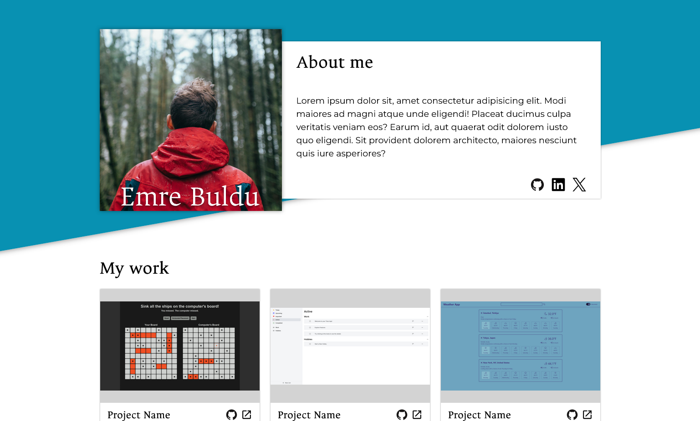

# Responsive Homepage

## Overview

This project is a responsive homepage built as part of the Advanced HTML and CSS course of The Odin Project. The goal was to design a portfolio-style homepage that works across desktop, tablet, and mobile screen sizes.

## Demo

[Check out the demo here](https://emre-oktay.github.io/responsive-homepage/)

## Screenshot

